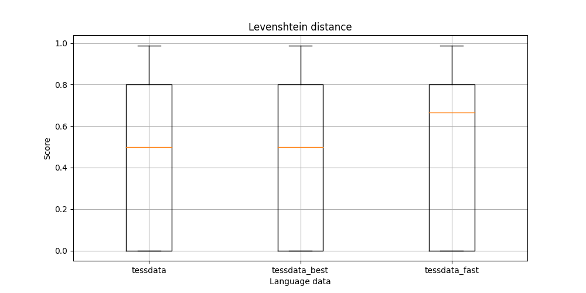

# Quick Analysis of Google's Tesseract OCR's Performance on Documents
Google's Tesseract engine is a well-known out-of-the-box solution for text recognition. This repository holds the code to reproduce the results reported [here](https://arvindrajan92.medium.com/googles-tesseract-ocr-how-good-is-it-on-documents-d71d4bf7640) discussing its performance on documents.

The DDI-100 dataset from Machine Intelligence Team was used for this study. They repository can be found [here](https://github.com/machine-intelligence-laboratory/DDI-100/tree/master/dataset).

## Results

### Direct match

### Levenshtein distance

### Image processing time

## Reproduce results
### Analyse
    python analyse.py --data_dir dataset/

### Visualise
    python visualise.py --result_dir results